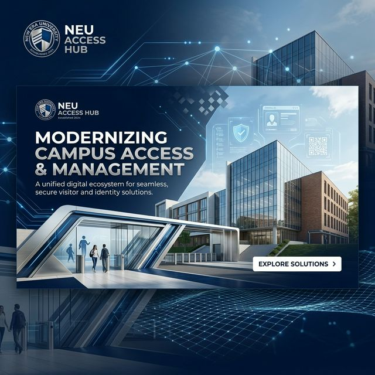

# Welcome to Antigravity!

Welcome to your new developer home! Your Firebase Studio project has been successfully migrated to Antigravity.

Antigravity is our next-generation, agent-first IDE designed for high-velocity, autonomous development. Because Antigravity runs locally on your machine, you now have access to powerful local workflows and fully integrated AI editing capabilities that go beyond a cloud-based web IDE.

## 🌐 Live Application
The project is deployed and accessible at:
👉 **[NEU Library Log - Live Portal](https://studio-3349078912-96ccd.web.app)**

## Getting Started
- **Run Locally**: Use the **Run and Debug** menu on the left sidebar to start your local development server.
  - Or in a terminal run `npm run dev` and visit `http://localhost:9002`.
- **Deploy**: You can deploy your changes to Firebase App Hosting by using the integrated terminal and standard Firebase CLI commands, just as you did in Firebase Studio.
- **Cleanup**: Cleanup unused artifacts with the @cleanup workflow.

Enjoy the next era of AI-driven development!

File any bugs at https://github.com/firebase/firebase-tools/issues

**Firebase Studio Export Date:** 2026-03-28


---

## Previous README.md contents:

# NEU Access Hub | Library Visitor Management



## 🌐 Project Overview

**NEU Access Hub** is a next-generation institutional access control and real-time visitor logging ecosystem developed for **New Era University**, specifically the **College of Informatics & Computing Sciences (CICS)**.

The portal optimizes academic operations through automated registry synchronization and high-precision resource tracking. It serves as a centralized hub for tracking facility visits, managing important academic announcements, and harmonizing student identity across the campus digital workspace.

---

## 🚀 Key Features

### 👤 Identity & Access

- **Institutional Single Sign-On:** Seamless and mandatory integration with `@neu.edu.ph` accounts.
- **Role-Based Command Center:** Granular control for Administrators, Members (Students/Staff), and Guests.
- **Silent Identity Handshake:** Advanced UI state management that ensures a smooth experience during transient authentication states.

### 📊 Real-Time Telemetry

- **Live Occupancy Tracking:** Instant visitor logging powered by Firestore `onSnapshot` technology.
- **Diagnostic Dashboard:** Real-time visibility into system health and database performance.
- **Academic Alerts:** Integrated advisory banners for real-time campus-wide announcements.

### 📐 Design & UX

- **Fluid Architecture:** An "Ultra-Responsive" grid system built with relative units (`rem`, `clamp()`) ensuring stability at any zoom level.
- **High-Fidelity UI:** A premium design system utilizing ShadCN and Tailwind CSS for a professional, institutional aesthetic.
- **Mobile-First Synchronization:** Custom hooks specifically tuned for responsive behavior on all device types.

### 🤖 Hub AI Assistant

- **Intelligent Navigation:** Ask the assistant to guide you to specific views or explain library analytics.
- **Policy Expert:** Get instant answers on book borrowing and institutional registry protocols.
- **Diagnostic Insights:** AI-powered analysis of system telemetry to help administrators resolve issues faster.

---

## 🛠 Technical Stack

Built with a modern, high-velocity stack designed for scalability and reliability:

- **Framework:** [Next.js 15 (App Router)](https://nextjs.org/)
- **Database / Auth:** [Firebase (Firestore & Authentication)](https://firebase.google.com/)
- **Intelligence:** [Genkit AI](https://github.com/firebase/genkit)
- **Styling:** [Tailwind CSS](https://tailwindcss.com/) & [ShadCN UI](https://ui.shadcn.com/)
- **Logic:** TypeScript, React Hook Form, Zod

---

## 📂 Project Structure

```bash
├── src/app             # Next.js App Router (Routes & Global Styles)
├── src/components      # Reusable UI & Feature Views (Dashboard, Auth, Guest)
├── src/firebase        # Real-time Client Providers & Hooks
├── src/hooks           # Custom React Logic & Responsive Hooks
├── src/lib             # Utility Functions & Academic Logic
├── src/ai              # Genkit AI Integrations
└── public              # Static Assets & Branding
```

---

## 💻 Getting Started

### Local Development

1. **Clone & Install:**
   ```bash
   npm install
   ```

2. **Configure Environment:**
   Create a `.env.local` file with your Firebase configuration (refer to `.env.example`).

3. **Launch Server:**
   ```bash
   npm run dev
   ```
   *Visit `http://localhost:9002` to view the portal.*

---

## 🛡 Security & Best Practices

- **Registry Protocols:** AES-256 cloud encryption with prioritized administrative security rules.
- **Session Persistence:** High-security protocol requiring identity verification for each browser session.
- **WCAG Compliance:** Adhering to accessibility standards for contrast and keyboard navigation.

---

© 2026 **NEW ERA UNIVERSITY** • **COLLEGE OF INFORMATICS & COMPUTING SCIENCES**

---

> [!NOTE]
> **IDE Maintenance:** This project has been successfully migrated to **Antigravity**.
> - **Local Server:** `npm run dev` (Port 9002)
> - **Deployments:** Use standard Firebase CLI via the integrated terminal.